# Doctor Chatbot - System Architecture Diagram

Single comprehensive architecture diagram for the Doctor Chatbot codebase.

---

## Detailed System Architecture

```mermaid
flowchart TB
    subgraph Client["🖥️ CLIENT LAYER"]
        User([User])
        subgraph React["React Frontend"]
            App[App.js]
            Chat[Chat.js]
            MessageBubble[MessageBubble]
            MessageInput[MessageInput]
            chatAPI[chatAPI.js]
        end
        User --> App
        App --> Chat
        Chat --> MessageBubble
        Chat --> MessageInput
        Chat --> chatAPI
    end

    subgraph API["📡 API LAYER - FastAPI main.py"]
        Auth["/auth/login<br/>JWT token"]
        ChatEP["/ask<br/>FormData: user_id, input, files"]
        HistoryEP["/chat/history<br/>GET/DELETE"]
        MCPEP["/mcp/chat<br/>JSON: query, user_id, attachments"]
        FeedbackEP["/feedback<br/>like/dislike"]
    end

    subgraph Core["⚙️ CORE"]
        Config[config.py]
        DBEngine[database.py<br/>async SQLAlchemy]
        Security[security.py<br/>JWT]
    end

    subgraph Business["📦 BUSINESS LOGIC"]
        ChatService[ChatService<br/>Intent → FAQ/SQL/Insights/QA]
        MCPOrch[MCP Orchestrator<br/>Router → Tools → Handlers]
    end

    subgraph MCP["🤖 MCP AGENT LAYER"]
        RouterAgent[Router Agent<br/>Qwen-VL: classify intent<br/>→ FAQ/USER_DATA/HEALTH/DOMAIN/ACTION]
        MCPTools[MCP Tools<br/>faq_lookup, kb_search<br/>user_data_query, generate_answer]
        AnswerAgent[Answer Agent<br/>LLM: format response]
        SQLTool[SQL Query Tool<br/>NL → SQL → execute]
        RouterAgent --> MCPTools
        MCPTools --> SQLTool
        MCPTools --> AnswerAgent
    end

    subgraph Services["🔧 DOMAIN SERVICES"]
        LLM[LLM Service<br/>Local + Gemini]
        Vector[Vector Service<br/>SentenceTransformer + ChromaDB]
        File[File Service<br/>PDF extract, image base64]
        S3[S3 Service<br/>AWS upload]
        DB[DB Service<br/>ChatHistory, Conversation<br/>UserUpload, Feedback, RxOrder]
    end

    subgraph Data["💾 DATA LAYER"]
        PG[(PostgreSQL<br/>wondrx schema<br/>chat_history, conversations<br/>user_uploads, feedback<br/>rx_orders, provider_orders)]
        Chroma[(ChromaDB<br/>FAQ embeddings<br/>consumer_FAQ.json)]
        AWS[(AWS S3<br/>chatbot-uploads)]
    end

    subgraph External["🌐 EXTERNAL"]
        LMStudio[LM Studio<br/>localhost:1234<br/>Qwen-VL]
        Gemini[Google Gemini<br/>gemini-2.5-flash]
    end

    chatAPI -->|"POST"| Auth
    chatAPI -->|"POST FormData"| ChatEP
    chatAPI -->|"GET/DELETE"| HistoryEP
    chatAPI -->|"POST JSON"| MCPEP
    chatAPI -->|"POST"| FeedbackEP

    Auth --> Security
    ChatEP --> ChatService
    HistoryEP --> DB
    MCPEP --> MCPOrch
    FeedbackEP --> DB

    ChatService --> LLM
    ChatService --> Vector
    ChatService --> File
    ChatService --> DB
    MCPOrch --> RouterAgent
    MCPOrch --> MCPTools
    MCPOrch --> DB

    File --> S3
    LLM --> LMStudio
    LLM --> Gemini
    Vector --> Chroma
    DB --> PG
    S3 --> AWS
    RouterAgent --> LMStudio
    AnswerAgent --> LMStudio
    SQLTool --> PG
    MCPTools --> Vector
    MCPTools --> LLM

    ChatService -.->|"file? → S3 + Vision"| File
    MCPOrch -.->|"attachments? → S3 + Vision"| File
    ChatService -.->|"faq → ChromaDB"| Vector
    MCPOrch -.->|"FAQ_ANSWER → verbatim"| Vector
    ChatService -.->|"user_data → SQL"| DB
    MCPOrch -.->|"USER_DATA_QUERY"| SQLTool
    MCPOrch -.->|"DOMAIN_QA → kb + answer"| MCPTools
    MCPOrch -.->|"HEALTH_INSIGHTS → fetch + analyze"| LLM
    MCPOrch -.->|"ACTION_REQUEST → rx_order"| DB
```

---

## Legend

| Layer | Components | Purpose |
|-------|------------|---------|
| **Client** | React App, Chat, chatAPI | User interface, message display, API calls |
| **API** | Auth, /ask, /chat/history, /mcp/chat, /feedback | REST endpoints |
| **Core** | config, database, security | App config, async DB engine, JWT |
| **Business** | ChatService, MCP Orchestrator | Intent routing, request orchestration |
| **MCP** | Router Agent, MCP Tools, Answer Agent, SQL Tool | Intent classification, FAQ/SQL/KB/Answer |
| **Services** | LLM, Vector, File, S3, DB | Domain logic, external integrations |
| **Data** | PostgreSQL, ChromaDB, S3 | Persistent storage |

**Request flows:**
- **/ask** (Normal): ChatService → classify intent → FAQ / SQL / Insights / Domain QA
- **/mcp/chat**: Orchestrator → Router Agent → MCP Tools → handlers
- **Files**: FileService → S3 upload + DB record → LLM Vision/PDF analysis

---

## How to View

- **VS Code**: Install "Mermaid" or "Markdown Preview Mermaid Support" extension
- **GitHub/GitLab**: Renders in Markdown preview
- **Online**: Paste into [mermaid.live](https://mermaid.live)
